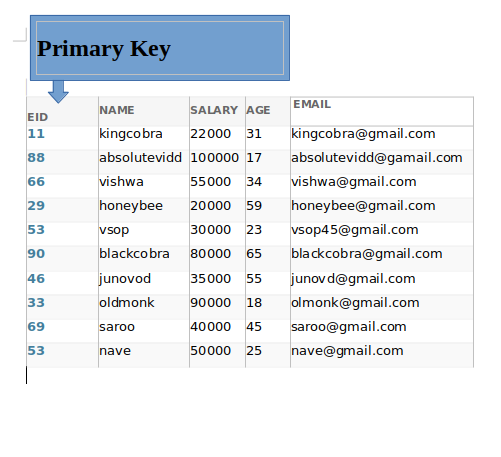
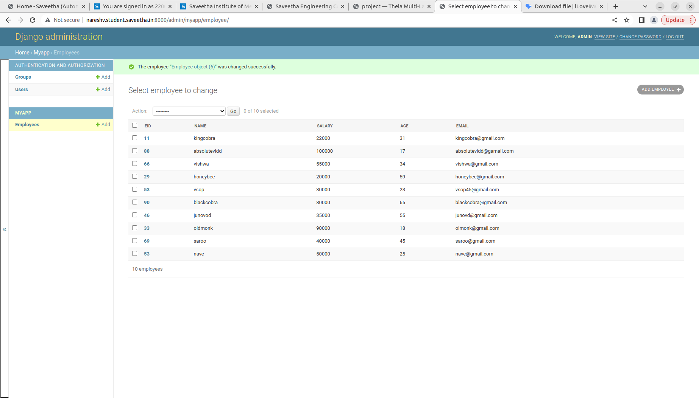

# Django ORM Web Application

## AIM
To develop a Django application to store and retrieve data from a database using Object Relational Mapping(ORM).

## Entity Relationship Diagram



## DESIGN STEPS

### STEP 1:
Clone the problem from github repository

### STEP 2:
Create a new app and change settings.py

### STEP 3:
Create employee database through admin and models python programs

## PROGRAM

```
Model.py

from django.db import models
from django.contrib import admin
class Employee(models.Model):
    eid=models.CharField(max_length=20,help_text="Employee ID")
    name=models.CharField(max_length=100)
    salary=models.IntegerField()
    age=models.IntegerField()
    email=models.EmailField()
class EmployeeAdmin(admin.ModelAdmin):
    list_display=('eid','name','salary','age','email'
    
Admin.py


```

## OUTPUT


## RESULT
Program executed successfully